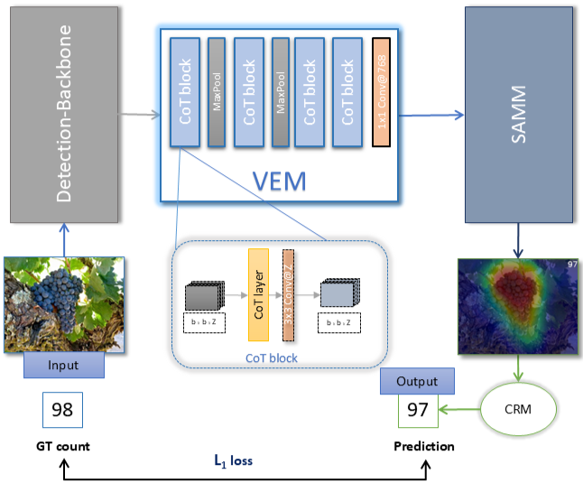

# SAVE: Self-Attention on Visual Embedding for zero-shot generic object counting  


## Environment 
Here is the code to setup the conda environment:
```bash
git clone https://github.com/AhmedZgaren/Save.git
cd Save
conda env create -f environment.yml
conda activate count
```
## Download trained model
We provide pre-trained model weights in FSC147:

[model](https://drive.google.com/file/d/1wvARqtm7dA28f5Hs5zlETF5OlkeT4osY/view?usp=drive_link)

Store the pre-trained model in the pre-trained folder. 


## Demo
To test the model in an image use the code below:
```bash
python demo.py --i path\to\img
```
## Train the model from scratch

### Download FSC147 dataset
Use this [link](https://drive.google.com/file/d/1ymDYrGs9DSRicfZbSCDiOu0ikGDh5k6S/view?usp=sharing) to download the FSC147 dataset and store images under the folder `.\data\images\`  

### Train your model
>To train the model just run the following command:
```bash
python train.py
```
### Test the trained model in different datasets

>To test the model in the FSC147 validation set:
```bash
python valid.py -valid True
```

>To test the model in the FSC147 test set:
```bash
python valid.py -test True
```
>To test the model in the COCO validation set:
```bash
python valid.py -vcoco True
```
>To test the model in the COCO test set:
```bash
python valid.py -tcoco True
```
